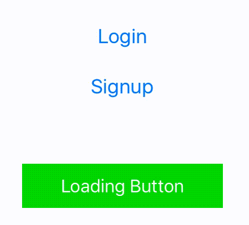

# LoadingButton

[](https://travis-ci.org/Septiyan Andika Isanta/LoadingButton)
[](http://cocoapods.org/pods/LoadingButton)
[](http://cocoapods.org/pods/LoadingButton)
[](http://cocoapods.org/pods/LoadingButton)

## Preview

<p align="center">
  
</p>

## Example

To run the example project, clone the repo, and run `pod install` from the Example directory first.

## Installation
1. Just add `LoadingButton.swift` file to your project (`LoadingButton/Classes/LoadingButton.swift`).

2. LoadingButton is available through [CocoaPods](http://cocoapods.org). To install
it, simply add the following line to your Podfile:

```ruby
pod "LoadingButton" 
```


## Options
* Start and stop loading button
    ```swift
    loginButton.loading = true
    loginButton.loading = false
    ```

* Set position of ActivityIndicator
    ```swift
    loginButton.indicatorAlignment = .Right
    signupButton.indicatorAlignment = .Left
    ```

* Text for title label when activity indicator is animating / loading
    ```swift
    loginButton.loadingText = "Authenticating"
    ```

* The color of the activity indicator
    ```swift
    loginButton.indicatorColor = UIColor.redColor()
    ```
 
## Author

Septiyan Andika Isanta, septiyan.andika@gmail.com

## License

LoadingButton is available under the MIT license. See the LICENSE file for more info.
